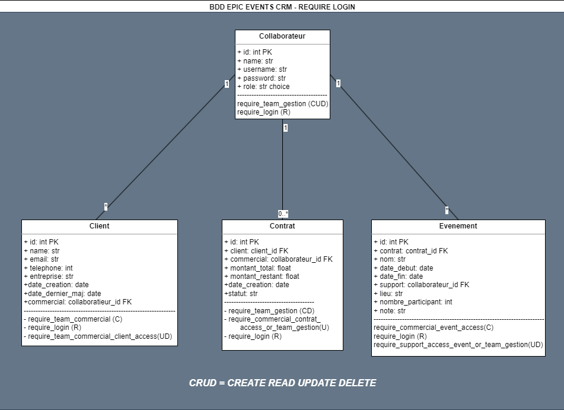

# Epic Events - CRM


Epic Events est une entreprise qui organise des événements (fêtes, réunions professionnelles,manifestations, ...) pour ses clients.
EpicEvents-CRM (CustomerRelationship Management) permet de collecter et de traiter les données des clients et de leurs événements, tout en facilitant la communication entre les différents pôles de l'entreprise. Applicaton Django utilisable en ligne de commande grâce à des commandes personnalisées.

# Sommaire

  - [Téléchargement de l'Application](#1-pour-commencer---le-téléchargement)
  - [Installation des dépendances](#2-installation-des-dépendances-packages)
  - [Créer la BDD](#3-création-de-la-base-de-donnée)
  - [Schéma de la BDD](#4-schéma-de-la-base-de-donnée)
  - [Créer un super utilisateur](#5-création-dun-superuser)
  - [Gestion des Exceptions & Erreur via Sentry](#6-gestion-des-exceptions--erreurs-via-sentry)
  - [Détails des commandes](#7-détails-des-commandes)

# **1/ Pour commencer - le téléchargement**

Télécharger l’intégralité du repository sur : https://github.com/Thomas-Savelli/Epic_Events_CRM.git

Pour ce faire, veuillez ouvrir votre Terminal de Commande: 

1. Grace à la commande cd , dirigez vous vers le répertoire ou vous voulez installer le repository exemple : ```cd Desktop``` *(pour l'installer sur le Desktop de votre ordinateur)*.

2. Par la suite, entrez dans votre terminal la commande : 
```
git clone https://github.com/Thomas-Savelli/Epic_Events_CRM.git
```
puis appuyer sur entrée afin de créer votre clone local.

# **2/ Installation des dépendances (packages)**

Une fois le repository téléchargé et stocké localement, rendez vous dans le dossier crm_epicevents/. Pour cela utiliser la commande : ```cd crm_epicevents```

- Créer un environnement virtuel afin de récupérer les dépendances et packages du projet.  
*exemple procedure* : ```python -m venv env```
- Contrôler avec ```ls``` que vous disposez maintenant d’un dossier env. Si ce n’est pas le cas, réitérer cette étape en contrôlant la syntaxe de la ligne de commande. Sinon activer votre nouvel environnement virtuel.
  
    exemple procédure : 
    - (PowerShell): ```.\env\Scripts\activate``` 
    - (Windows): ```.\env\Scripts\activate.bat```
    - (autres): ```source env/bin/activate```

*Si vous rencontrez des difficultés vous pouvez vous référer sur le site :* https://stackoverflow.com/questions/18713086/virtualenv-wont-activate-on-windows/18713789#18713789
  
  Pour contrôler la réussite de cette manœuvre, vous devriez avoir un ```(env)``` devant votre ligne de commande.

  PS : Taper seulement ```deactivate``` pour fermer ce dernier.

Pour finir, télécharger avec pip les packages et dépendances requis pour le bon fonctionnement du code avec le requirements.txt en entrant la commande suivante *(dans votre environnement virtuel !)* 

```pip install -r requirements.txt``` 

Une fois le téléchargement effectué et l'installation terminée, vous êtes prêt à exécuter le code.

# **3/ Création de la Base de Donnée**

Afin de pouvoir créer la Base de donnée, il faut effectuer la commande ```python manage.py migrate```, assurez-vous que vous vous situer dans le même dossier que votre fichier ```manage.py```.

# **4/ Schéma de la Base de Donnée**




# **5/ Création d'un SuperUser**

Pour utiliser l'application Epic Events - CRM, vous devez créer un superutilisateur. Le superutilisateur a des droits d'administration étendus et peut gérer tous les aspects de l'application. Voici comment procéder :

Assurez-vous que l'environnement virtuel est activé. Si ce n'est pas le cas, activez-le en utilisant la commande suivante appropriée.
```
source env/bin/activate  # Linux/macOS
env\Scripts\activate     # Windows
```
Puis assurez-vous d'étre dans le dossier racine de l'application Epic Events - CRM :
Utilisez la commande suivante pour créer un superutilisateur :
```
python manage.py createsuperuser
```
Suivez les instructions à l'écran pour finaliser la création de votre super utilisateur.

Une fois le superutilisateur créé, vous pourrez l'utiliser pour vous connecter à l'interface d'administration de l'application.
```
python manage.py runserver
```
Accédez à http://127.0.0.1:8000/admin/ dans votre navigateur et connectez-vous avec les informations du superutilisateur que vous venez de créer.

Avec le superutilisateur, vous pourrez gérer tous les aspects de l'application, y compris la création, la modification et la suppression d'utilisateurs, de clients, de contrats, d'événements, etc.*

Afin de pouvoir utiliser l'application en ligne de commande, il ne vous reste plus qu'à créer le premier collaborateur de role gestion pour pouvoir.

# **6/ Gestion des Exceptions & Erreurs via Sentry**
Afin de pouvoir voir et gérer les exceptions et les erreurs via Sentry, veuillez suivre les étapes ci_dessous : 
- 1 : Veullez vous créer un compte sur *https://sentry.io/signup/*
- 2 : Un fois cela fait, Sentry vous demandera de choisir votre plateforme. Choisisez : DJANGO, puis créer votre projet.
- 3 : Le site Sentry vous donne maintenant votre key dsn. Rendez-vous dans :
```
/crm_epicevents/settings.py/
```
et rensegner votre key dsn ici : 
```
sentry_sdk.init(
    dsn="VOTRE KEY DSN",
    # Set traces_sample_rate to 1.0 to capture 100%
    # of transactions for performance monitoring.
    traces_sample_rate=1.0,
    # Set profiles_sample_rate to 1.0 to profile 100%
    # of sampled transactions.
    # We recommend adjusting this value in production.
    profiles_sample_rate=1.0,
)
```
- 4 : Pour tester que Sentry est bien configurée, lancer votre serveur local avec :
```
python manage.py runserver
```
puis dans votre navigateur entrez l'url :
```
http://127.0.0.1:8000/sentry-debug/
```
Si vous obtenez une Erreur : *ZeroDivisionError at /sentry-debug/*, c'est que Sentry est bien configurée. Vous obtiendrez sous quelques secondes l'erreur sur la plateforme Sentry.

# **7/ Détails des commandes**
Si vous désirez de l'aide pour une commande utilisez l'argument : ```commande --help```

<details>
<summary>LOGIN - voir la description de la commande</summary>

### **`Login`**
#### **Description :**
Cette commande permet de se connecter au CRM d'epic events.
```
python manage.py login
```
#### **Arguments :**

- ```username``` : Username du collaborateur.
- ```password``` : Mot de passe du collaborateur

#### **Exemple :**
```
>> python manage.py login
>> Ronald3
>> passwordtest
```
#### **Remarques :**
- Vous serez invité à entrer un username et un mot de passe une fois la commande saisie.
</details>

<details>
<summary>LOGOUT - voir la description de la commande</summary>

### **`Logout`**
#### **Description :**
Cette commande permet de se déconnecter du CRM d'epic events.
```
python manage.py logout
```

#### **Exemple :**
```
>> python manage.py logout
```
#### **Remarques :**
- Une déconnection supprimera votre token access. Ce qui obligera une reconnexion lors de votre prochaine utilisation du CRM.
- Notez que votre token access dispose d'une durée de vie limité. Ce qui nécéssitera lors d'une longue session de travail à vous reconnecter même si la commande de déconnexion n'a pas été utilisée.
</details>

<details>
<summary>CREATE COLLABORATEUR - voir la description de la commande</summary>

### **`Create_collaborateur`**
#### **Description :**
Cette commande crée un collaborateur avec un nom complet, un rôle et un nom d'utilisateur.
```
python manage.py create_collaborateur nom_complet role username
```
#### **Arguments :**

- ```nom_complet``` : Nom complet du collaborateur.
- ```role``` : Rôle du collaborateur (commercial, support, gestion).
- ```username``` : Nom d'utilisateur.

#### **Exemple :**
```
python manage.py create_collaborateur "John Doe" commercial john_doe
```
#### **Remarques :**

- Vous serez invité à entrer un mot de passe une fois les arguments saisis.
- Cette commande nécessite une connexion préalable et des permissions d'équipe de gestion.
</details>
<details>
<summary>CREATE CLIENT - voir la description de la commande</summary>

### **`Create_client`**
#### **Description :**
Cette commande crée un nouveau client avec des informations telles que le nom complet, l'e-mail, le numéro de téléphone, l'entreprise et la date de création.
```
python manage.py create_client nom_complet email telephone entreprise 
```
#### **Arguments :**

- ```nom_complet``` : Nom complet du client.
- ```email``` : E-mail du client.
- ```telephone``` : Numéro de téléphone du client.
- ```entreprise``` : Entreprise du client.
- ```--date_derniere_maj``` : Date de dernière mise à jour au format YYYY-MM-DD HH:MM:SS.
#### **Exemple :**
```
python manage.py create_client "John Doe" john.doe@example.com 123456789 MyCompany --date_derniere_maj "2023-01-01 12:30:00"
```
#### **Remarques :**

- La date de création sera automatiquement définie sur la date actuelle.
- Vous pouvez spécifier la date de dernière mise à jour en utilisant l'option --date_derniere_maj.
- Cette commande nécessite une connexion préalable et des permissions d'équipe commerciale.
</details>
<details>
<summary>CREATE CONTRAT - voir la description de la commande</summary>

### **`Create_contrat`**
#### **Description :**
Cette commande crée un nouveau contrat associé à un client et un commercial avec les détails du contrat tels que le montant total, le montant restant à payer et le statut du contrat.
```
python manage.py create_contrat client_id commercial_id montant_total montant_restant statut
```
#### **Arguments :**

- ```client_id``` : ID du client associé au contrat (entier).
- ```commercial_id``` : ID du commercial associé au contrat (entier).
- ```montant_total``` : Montant total du contrat (nombre à virgule flottante).
- ```montant_restant``` : Montant restant à payer du contrat.
- ```statut``` : Statut du contrat (parmi les options : attente signature, signé, en cours, terminé, résilié, annulé).

#### **Exemple :**
```
python manage.py create_contrat 123 456 5000 3000 "en cours"
```
#### **Remarques :**

- Vous devez être connecté et avoir les permissions d'équipe de gestion.
- Assurez-vous que les IDs de client et commercial existent avant d'exécuter la commande.
- Le statut doit être l'un des choix valides : attente signature, signé, en cours, terminé, résilié, annulé.
</details>
<details>
<summary>CREATE EVENEMENT - Voir la description de la commande</summary>

### **`Create_evenement`**
#### **Description :**
Cette commande crée un nouvel événement lié à un contrat avec des détails tels que le nom, les dates de début et de fin, le support, le lieu, le nombre de participants et des notes.
```
python manage.py create_evenement contrat_id nom date_debut date_fin support_id lieu nombre_participants notes
```
#### **Arguments :**
- ```contrat_id``` : ID du contrat lié à l'événement (entier).
- ```nom``` : Nom de l'événement.
- ```date_debut``` : Date de début de l'événement (au format YYYYMMDD).
- ```date_fin``` : Date de fin de l'événement (au format YYYYMMDD).
- ```support_id``` : ID du collaborateur (support) lié à l'événement (entier).
- ```lieu``` : Lieu de l'événement.
- ```nombre_participants``` : Nombre de participants à l'événement (entier).
- ```notes``` : Notes sur l'événement.

#### **Exemple :**
```
python manage.py create_evenement 123 "Événement Test" 20220301 20220305 456 "Lieu de l'événement" 100 "Notes sur l'événement"
```

#### **Remarques :**
- Vous devez être connecté et être le collaborateur commercial rattaché au Client du contrat de l'evenement.
- Assurez-vous que les IDs de contrat et de collaborateur (support) existent avant d'exécuter la commande.
- Les dates de début et de fin doivent être au format YYYYMMDD.
</details>

<details>
<summary>DELETE COLLABORATEUR - Voir la description de la commande</summary>

### **`Delete_Collaborateur`**
#### **Description :**
Cette commande permet de supprimer un Collaborateur seulement avec son ID.
```
python manage.py delete_collaborateur user_id
```

#### **Remarques :**
- Vous devez être connecté et être un collaborateur du pôle Gestion pour pouvoir effectuer cette action.
- Assurez-vous que l'ID du collaborateur que vous voulez supprimer soit le bon. Une fois supprimé, cette action ne pourras pas être annulée.
</details>

<details>
<summary>DELETE CLIENT - Voir la description de la commande</summary>

### **`Delete_Client`**
#### **Description :**
Cette commande permet de supprimer un Client seulement avec son ID.
```
python manage.py delete_client client_id
```

#### **Remarques :**
- Vous devez être connecté et être le Collaborateur du pôle Commercial assigné au Client pour pouvoir effectuer cette action.
- Assurez-vous que l'ID du Client que vous voulez supprimer soit le bon. Une fois supprimé, cette action ne pourras pas être annulée.
</details>

<details>
<summary>DELETE CONTRAT - Voir la description de la commande</summary>

### **`Delete_Contrat`**
#### **Description :**
Cette commande permet de supprimer un Contrat seulement avec son ID.
```
python manage.py delete_contrat contrat_id
```

#### **Remarques :**
- Vous devez être connecté et être un Collaborateur du pôle Gestion pour pouvoir effectuer cette action.
- Assurez-vous que l'ID du Contrat que vous voulez supprimer soit le bon. Une fois supprimé, cette action ne pourras pas être annulée.
</details>

<details>
<summary>DELETE EVENEMENT - Voir la description de la commande</summary>

### **`Delete_Evenement`**
#### **Description :**
Cette commande permet de supprimer un Evenement seulement avec son ID.
```
python manage.py delete_evenement evenement_id
```

#### **Remarques :**
Vous devez être connecté et : 
- 1 : Soit être un Collaborateur du pôle Gestion pour pouvoir effectuer cette action.
- 2 : Soit être le Collaborateur du pôle Support assigné à cet evenement.

Assurez-vous que l'ID du Client que vous voulez supprimer soit le bon. Une fois supprimé, cette action ne pourras pas être annulée.
</details>

<details>
<summary>RETRIEVE COLLABORATEUR - Voir la description de la commande</summary>

### **`Retrieve_Collaborateur`**
#### **Description :**
Cette commande permet de rechercher tous les Collaborateurs enregistrés.
```
python manage.py retrieve_collaborateur
```
#### **Arguments :**
Si vous désirez afficher un Collaborateur particulier, vous pouvez utiliser des arguments :

- ```collaborateur_id``` : ID du Collaborateur
- ```--nom_complet``` : Nom complet du collaborateur.
- ```--role``` : Rôle du collaborateur (Commercial, Support, Gestion).
- ```--username``` : Nom d'utilisateur.

#### **Exemple :**
```
python manage.py retrieve_collaborateur 10 
python manage.py retrieve_collaborateur --nom_complet="harry potter"
python manage.py retrieve_collaborateur --role="support"
```
#### **Remarques :**
- Vous devez seulement être connecté pour pouvoir utiliser cette commande.
- Vous pouvez affiner vos recherches en combinant plusieurs arguments !
</details>

<details>
<summary>RETRIEVE CLIENT - Voir la description de la commande</summary>

### **`Retrieve_Client`**
#### **Description :**
Cette commande permet de rechercher tous les Clients enregistrés.
```
python manage.py retrieve_client
```
#### **Arguments :**
Si vous désirez afficher un Client particulier, vous pouvez utiliser des arguments :

- ```client_id``` : ID du Client
- ```--nom_complet``` : Nom complet du Client.
- ```--email``` : Email du Client.
- ```--telephone``` : Telephone du Client.
- ```--entreprise``` : Entreprise du Client

#### **Exemple :**
```
python manage.py retrieve_client 10 
python manage.py retrieve_client --nom_complet="Rogue Severius"
python manage.py retrieve_client --email="roguesev@sepentard.com"
python manage.py retrieve_client --telephone=0101010101
python manage.py retrieve_client --entreprise="Mangemort & Company"
```
#### **Remarques :**
- Vous devez seulement être connecté pour pouvoir utiliser cette commande.
- Vous pouvez affiner vos recherches en combinant plusieurs arguments !
</details>

<details>
<summary>RETRIEVE CONTRAT - Voir la description de la commande</summary>

### **`Retrieve_Contrat`**
#### **Description :**
Cette commande permet de rechercher tous les Contrat enregistrés.
```
python manage.py retrieve_contrat
```
#### **Arguments :**
Si vous désirez afficher un Contrat particulier, vous pouvez utiliser des arguments :

- ```contrat_id``` : ID du Contrat
- ```--client``` : Filtre les Contrats par client (nom ou ID)
- ```--commercial``` : Filtre les Contrats par commercial (nom ou ID)
- ```--montant_total``` : Montant total du Contrat
- ```--montant_restant``` : Montant restant du Contrat
- ```--statut``` : Statut du Contrat (attente signature, signé, en cours, terminé, résilié, annulé)
- ```--date_creation``` : Date de création du Contrat (format : YYYY-MM-DD)

#### **Exemple :**
```
python manage.py retrieve_contrat 10(contrat id) 12(client id) 5(collaborateur id)  
python manage.py retrieve_contrat --montant_total=1000
python manage.py retrieve_contrat --statut="attente signature"
python manage.py retrieve_contrat --date_creation=2023-12-12
```
#### **Remarques :**
- Vous devez seulement être connecté pour pouvoir utiliser cette commande.
- Vous pouvez affiner vos recherches en combinant plusieurs arguments !
</details>

<details>
<summary>RETRIEVE EVENEMENT - Voir la description de la commande</summary>

### **`Retrieve_Evenement`**
#### **Description :**
Cette commande permet de rechercher tous les Evenements enregistrés.
```
python manage.py retrieve_evenement
```
#### **Arguments :**
Si vous désirez afficher un Evenement particulier, vous pouvez utiliser des arguments :

- ```evenement_id``` : ID de l'Evenement
- ```--contrat``` : Filtre les événements par contrat (ID)
- ```--nom``` : Filtre les événements par nom
- ```--date_debut``` : Filtre les événements par date de début (format : YYYY-MM ou YYYY-MM-DD)
- ```--date_fin``` : Filtre les événements par date de fin (format : YYYY-MM ou YYYY-MM-DD)
- ```--support``` : Filtre les événements par support (nom ou ID)
- ```--lieu``` : Filtre les événements par lieu
- ```--participants``` : Filtre les événements par nombre de participants (ex: -50, +50, +100, +200)
#### **Exemple :**
```
python manage.py retrieve_evenement 10
python manage.py retrieve_evenement --contrat=2
python manage.py retrieve_evenement --nom="mariage"
python manage.py retrieve_evenement --date_debut=2023-12
python manage.py retrieve_evenement --support=2
python manage.py retrieve_evenement --lieu="poudlard"
python manage.py retrieve_evenement --participants=+50
```
#### **Remarques :**
- Vous devez seulement être connecté pour pouvoir utiliser cette commande.
- Vous pouvez affiner vos recherches en combinant plusieurs arguments !
</details>


<details>
<summary>UPDATE COLLABORATEUR - Voir la description de la commande</summary>

### **`Update_Collaborateur`**
#### **Description :**
Cette commande permet de mettre à jour un Collaborateur avec son ID.
```
python manage.py update_collaborateur user_id
```
#### **Arguments :**
Liste des arguments sélectionnable pour une mise à jour de Collaborateur :

- ```user_id``` : ID du collaborateur à modifier
- ```--nom_complet``` : Nouveau nom complet du collaborateur
- ```--role``` : Nouveau rôle du collaborateur (gestion, commercial, support)
- ```--username``` : Nouveau nom d'utilisateur du collaborateur

#### **Exemple :**
```
python manage.py update_collaborateur 1 --nom_complet="ronald weasley"
python manage.py update_collaborateur 1 --role="commercial" --username="Hpotter3"
```
#### **Remarques :**
- Vous devez être connecté et être un Collaborateur du pôle gestion pour pouvoir utiliser cette commande.
- Vous pouvez combiner plusieurs arguments pour modifier plusieurs champs !
</details>

<details>
<summary>UPDATE CLIENT - Voir la description de la commande</summary>

### **`Update_Client`**
#### **Description :**
Cette commande permet de mettre à jour un Client avec son ID.
```
python manage.py update_client client_id
```
#### **Arguments :**
Liste des arguments sélectionnable pour une mise à jour d'un Client :

- ```client_id``` : ID du Client à modifier
- ```--nom_complet``` : Nouveau nom complet du client
- ```--email``` : Nouvel email du client
- ```--telephone``` : Nouveau numero de telephone du client
- ```--entreprise``` : Nouvelle entreprise du client

#### **Exemple :**
```
python manage.py update_client 1 --nom_complet="rogue severus"
python manage.py update_collaborateur 1 --email="rogue.sev@mangemort.com" --entreprise="Voldemort Entreprise"
```
#### **Remarques :**
- Vous devez être connecté et être le Collaborateur commercial du Client pour pouvoir utiliser cette commande.
- Vous pouvez combiner plusieurs arguments pour modifier plusieurs champs !
</details>

<details>
<summary>UPDATE CONTRAT - Voir la description de la commande</summary>

### **`Update_Contrat`**
#### **Description :**
Cette commande permet de mettre à jour un Contrat avec son ID.
```
python manage.py update_contrat contrat_id
```
#### **Arguments :**
Liste des arguments sélectionnable pour une mise à jour d'un Contrat :

- ```contrat_id``` : ID du Contrat à modifier
- ```--montant_total``` : Nouveau montant total
- ```--montant_restant``` : Nouvel montant restant
- ```--statut``` : Nouveau statut (parmi les options : attente signature, signé, en cours, terminé, résilié, annulé).
- ```--commercial_id``` : ID du nouveau Commercial

#### **Exemple :**
```
python manage.py update_contrat 1 --montant_total=2000
python manage.py update_contrat 1 --commercial_id=10 --statut="signé"
```
#### **Remarques :**
- Vous devez être connecté et être le Collaborateur commercial du Contrat pour pouvoir utiliser cette commande ou un Collaborateur du pôle Gestion.
- Vous pouvez combiner plusieurs arguments pour modifier plusieurs champs !
</details>

<details>
<summary>UPDATE EVENEMENT - Voir la description de la commande</summary>

### **`Update_Evenement`**
#### **Description :**
Cette commande permet de mettre à jour un Evenement avec son ID.
```
python manage.py update_evenement evenement_id
```
#### **Arguments :**
Liste des arguments sélectionnable pour une mise à jour d'un Evenement :

- ```evenement_id``` : ID de l'Evenement à modifier
- ```--nom``` : Nouveau nom de l'Evenement
- ```--date_debut``` : Nouvelle date de début (format YYYYMMDD)
- ```--date_fin``` : Nouvelle date de fin (format YYYYMMDD)
- ```--lieu``` : Nouveau lieu de l'Evenement
- ```--nombre_participants``` : Nouveau nombre de participants
- ```--notes``` : Nouvelles notes
- ```--support_id``` : ID du nouveau Collaborateur support

#### **Exemple :**
```
python manage.py update_evenement 1 --nom="Mariage Weasley"
python manage.py update_evenement 1 --support_id=9 --nombre_participants=50
```
#### **Remarques :**
- Vous devez être connecté et être le Collaborateur Support lié à l'Evenement pour pouvoir utiliser cette commande ou être un Collaborateur du pôle Gestion.
- Vous pouvez combiner plusieurs arguments pour modifier plusieurs champs !
</details>


# Dévellopé avec

* Python3 -  [*https://docs.python.org/fr/3/tutorial/index.html*]
* Django -  [*https://pypi.org/project/Django/*]
* PyJWT - [*https://pypi.org/project/PyJWT/*]
* Pytest - [*https://pypi.org/project/pytest/*]
* sentry-sdk - [*sentry-sdk*]
* IDE - [*https://code.visualstudio.com/*] - Visual Studio Code     
* PowerShell - [*https://learn.microsoft.com/fr-fr/powershell/scripting/overview?view=powershell-7.3*]  
* GitHub - [*https://github.com/*]

## Versions

**Dernière version stable :** Beta 1.0.0  
**Dernière version :** Beta 1.0.0  

## Auteur  
* **Thomas Savelli** [https://github.com/Thomas-Savelli] - ``Devellopeur Python - Junior - Epic Events``  